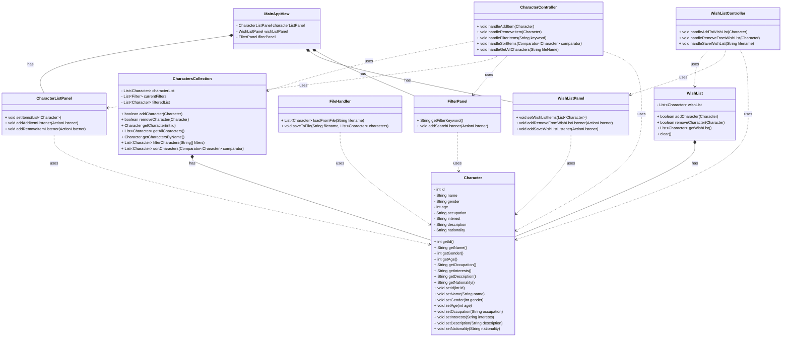

5004 Group3 final project proposal

TimeLine:

Draft	April 2

Proposal	April 3

First Discussion (basic features)	April 3 Afternoon

Graphical User Interface April 6

Search, sort, filter items in the collections April 8

Include images for your items April 10

Second Discussion	April 10 Morning

Final Draft	April 13

Code walking preparation	April 14

Demonstration	April 15

Retrospective	April 21

Description:
We are developing a wishing list that users can save celebrities that they like into sharing with friends.
Users can search for celebrities by name and apply filters such as age, gender, interests, and astrology sign
to narrow down their options. Results can be sorted by distance or recent activity.

Basic features:
* View all items in the collection
* Build a list of items from the collection 
* Save out that list using a file format we covered in the course such as .xml, .json, or .csv.

Additional features:
* Graphical User Interface (java swing)
* Be able to search for items in the collection
* Be able to sort items in the collection
* Be able to filter items in the collection
* Have your original item list come from an online API/online access
* Include images for your items

UML:

Workflow:

When the user enters a keyword in the FilterPanel and clicks the "Search" button:

The FilterPanel triggers the handleFilterItems() method in the ItemController.

The ItemController calls ItemCollection.filterItems() to retrieve the results.

The ItemController then calls ItemListPanel.setItems() to update the displayed content.

Similarly, when the user wants to save the wishlist:

The user clicks the "Save Wishlist" button in the WishListPanel.

The WishListPanel notifies the WishListController to execute the handleSaveWishList() method.

The WishListController calls FileHandler.saveToFile() to write the wishlist to a file.

Task allocation:

Alvin:
* API data collection： celebrities.json  (raw data)
* Java Swing GUI

LU ZHANG:
* CharacterCollection:Part 1
* CharacterCollection: filter
* CharacterController: filter

Xinqi Cao:
* CharacterCollection:Part 2
* CharacterCollection: sort
* CharacterController: sort

Hewen:
* CharacterRecord, WishingLIst Controller & Model, FileHandler

