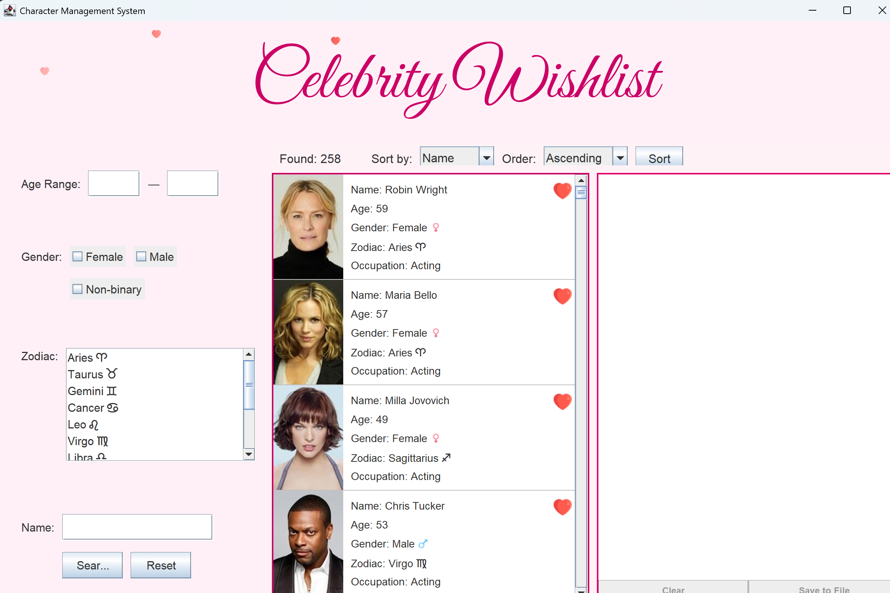
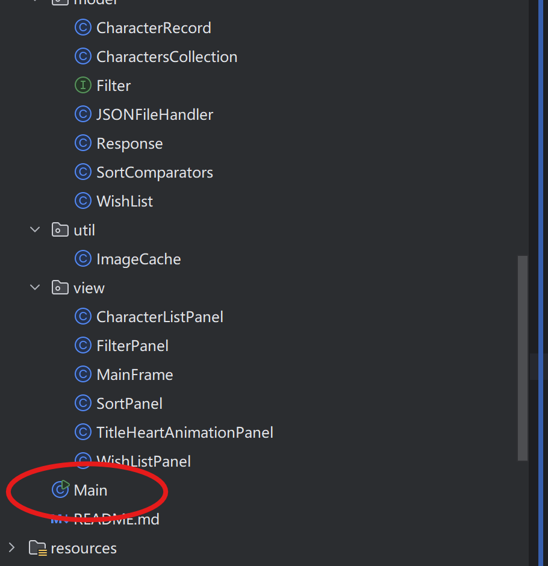
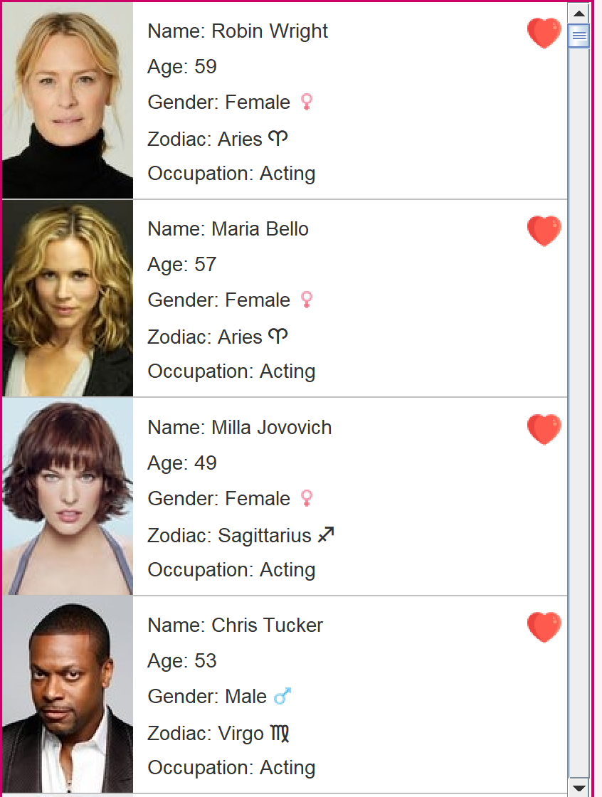

# Manual 

Character Management System
User Manual

1. Introduction

The Character Management System is a user-friendly application for managing and viewing celebrity information. This manual will guide you through installation, setup, and usage of the application.

2. Installation Guide
Step 1: Download the application package
Step 2: Install Java if not already installed
Step 3: Run the installation file
Step 4: Follow the installation wizard
Step 5: Launch the application

4. Getting Started

4.1 Initial Setup
- Launch the application
- Wait for initial data loading
- Familiarize yourself with the interface

4.2 Interface Overview
- Filter Panel
  - Use filter options
  - Apply multiple filters
  - Clear filters
  - Save filter preferences

- Character List Panel
  - Scroll through character list
  - View character details
  - Click on character for more information
  

- Sort Panel
    - Sort by name
    - Sort by age
    - Sort by gender
    - Custom sort options

- Wishlist Panel
  - Add characters to wishlist
  - Remove characters from wishlist
  - Save wishlist to file
  - Load saved wishlist

